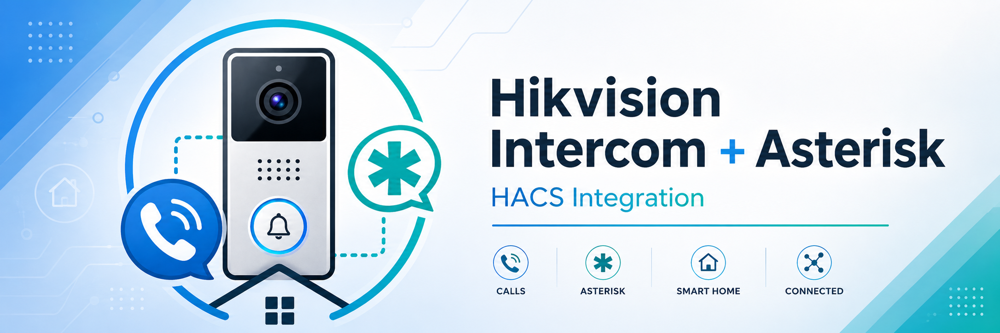

<p align="center">
  
</p>

# Hikvision SIP Doorbell

[](https://github.com/edsol/hikvision-sip-doorbell)
[](https://www.home-assistant.io/)
[](LICENSE)

Route Hikvision doorbell calls through Asterisk — without the Hikvision app.

When someone rings your **Hikvision DS-KV6113** (or compatible) doorbell, this integration:
- rings your **indoor SIP phone** when you're home
- calls your **mobile number** when you're away or on vacation
- does **nothing** when deactivated

Everything is controlled via a simple mode selector in Home Assistant.

---

## How it works

```
Doorbell rings
    │
    ▼
MQTT event (Hikvision Addons addon) → Home Assistant updates call_state sensor
    │
    ▼
Asterisk reads routing/channel from AstDB → Dial()
    │
    ├─ at_home        → rings indoor SIP extension (e.g. a softphone or WebRTC client)
    ├─ away_from_home → calls your mobile via SIP trunk
    ├─ vacation        → calls your mobile via SIP trunk
    └─ deactivated     → no call placed
```

No polling, no AGI scripts. Home Assistant writes the routing target to **Asterisk AstDB** whenever the mode or phone number changes. Asterisk reads it at ring time and dials directly — HA is not in the call path.

During an active call, pressing `#` on your mobile opens the gate relay on the doorbell panel (DTMF passthrough, no extra configuration needed).

---

## Requirements

| Requirement | Notes |
|---|---|
| [Hikvision Addons](https://github.com/pergolafabio/Hikvision-Addons) | MQTT addon — publishes doorbell events to Home Assistant |
| [Asterisk integration](https://github.com/TECH7Fox/asterisk-hass-integration) | Connects HA to your Asterisk PBX via AMI |
| Asterisk PBX | With at least one PJSIP extension and optionally a SIP trunk |
| Home Assistant MQTT | Standard HA MQTT integration |

---

## Installation

### Via HACS (recommended)

[](https://my.home-assistant.io/redirect/hacs_repository/?owner=edsol&repository=hikvision-sip-doorbell&category=integration)

Or manually:
1. Open HACS → **Integrations** → ⋮ menu → **Custom repositories**
2. Add this repository URL, category: **Integration**
3. Search for **Hikvision SIP Doorbell** and install
4. Restart Home Assistant

### Manual

1. Download and copy the `hikvision_sip_doorbell` folder into your `custom_components/` directory
2. Restart Home Assistant

---

## Setup

Go to **Settings → Integrations → Add Integration → Hikvision SIP Doorbell**.

The setup wizard has two steps:

### Step 1 — Device & SIP settings

All fields use **entity selectors** — just pick from dropdowns, no typing required.

| Field | What to select |
|---|---|
| **MQTT sensor** | The `Call state` sensor from your doorbell (created by Hikvision Addons) |
| **Doorbell SIP extension** | The Asterisk PJSIP endpoint for the doorbell panel (e.g. `PJSIP/6001`) |
| **Indoor SIP extension** | The Asterisk PJSIP endpoint to ring when at home (e.g. `PJSIP/6002`) |
| **SIP trunk** | The Asterisk trunk for external calls (e.g. `PJSIP/my-trunk`) |
| **VoIP domain** | Your SIP provider domain — **auto-discovered from Asterisk** after setup |

### Step 2 — Phone numbers

Select the `input_text` entities that hold the phone numbers to call for each external mode. You can use the same number for both modes, or different ones.

> **Phone number format**: the value in `input_text` is used as-is in the SIP URI. Use your provider's expected format (e.g. `+391234567890` or `0391234567890`).

---

## Device page

After setup, the device page shows:

**Controls**
- `Doorbell Mode` — change between at_home / away_from_home / vacation / deactivated

**Sensors**
- `Call State` — current doorbell state (idle, ringing, answered, dismissed)
- `Number to Call` — phone number active for the current mode
- `Active Contact` — contact name shown on the doorbell panel

**Diagnostics**
- `Doorbell Extension`, `Internal Extension`, `SIP Trunk`, `SIP Domain` — active configuration values
- `Discover SIP Domain` button — re-reads the VoIP domain from Asterisk on demand
- `Sync Routing to Asterisk` button — manually writes current routing to AstDB (useful after Asterisk restart)

---

## SIP domain auto-discovery

You don't need to know your SIP provider's domain in advance. After the first setup:

1. The integration reads it automatically from Asterisk using the `PJSIPShowEndpoint` AMI command
2. The `SIP Domain` sensor updates with the discovered value (e.g. `sip.myprovider.com`)
3. The value is saved permanently — discovery only runs once unless you press the button again

---

## Asterisk configuration

### extensions.conf

Add a `[from-door]` context — this is where the doorbell INVITE lands. Asterisk reads the target channel from AstDB (written by HA) and dials directly:

```ini
[from-door]
exten => _X.,1,NoOp(Doorbell ring on ${EXTEN})
 same => n,Set(CALLERID(num)=Doorbell)
 same => n,Set(CALLERID(name)=Doorbell)
 same => n,Answer()
 same => n,Playtones(ring)
 same => n,Set(DEST=${DB(routing/channel)})
 same => n,Set(ENDPT=${DB(routing/endpoint)})
 same => n,GotoIf($["${DEST}" = ""]?noanswer,1)
 same => n,Set(ATTEMPTS=0)
 same => n(retry),GotoIf($[${ATTEMPTS} >= 9]?noanswer,1)
 same => n,Set(ATTEMPTS=$[${ATTEMPTS} + 1])
 same => n,GotoIf($["${ENDPT}" = ""]?dial)
 same => n,GotoIf($["${DEVICE_STATE(PJSIP/${ENDPT})}" != "UNAVAILABLE"]?dial)
 same => n,Wait(5)
 same => n,Goto(retry)
 same => n(dial),NoOp(Dialling ${DEST})
 same => n,Dial(${DEST},30)
 same => n,Hangup()

exten => noanswer,1,StopPlaytones()
exten => noanswer,n,Hangup()
```

The doorbell PJSIP endpoint (`6001` in the example) must have `context=from-door` in `pjsip.conf`.

> **Note:** `Answer()` + `Playtones(ring)` keeps the doorbell ringing for the entire setup phase — including the 13s Iliad delay for external calls. `Dial()` stops the tones automatically when the call is answered. `StopPlaytones()` is only called on the `noanswer` path. For internal calls (`at_home`), Asterisk polls the endpoint every 5 seconds for up to ~45 seconds before dialling.

### DTMF gate control

Pressing `#` on your mobile during an active call opens the gate relay. This works automatically via Asterisk's DTMF conversion between the trunk (RFC 4733) and the doorbell endpoint (SIP INFO). No dialplan changes needed.

### manager.conf

The Home Assistant AMI user needs read/write access to use `DBPut` and `PJSIPShowEndpoint`:

```ini
[homeassistant]
secret = your_secret
read = all
write = all
```

After setup, verify AstDB is populated:

```bash
asterisk -rx "database show routing"
```

Expected output (example for `at_home` mode):
```
/routing/channel   : PJSIP/6002
/routing/fallback  : wait
/routing/mode      : at_home
```

> **Tip:** If Asterisk restarts before HA, AstDB may be empty. Use the **Sync Routing to Asterisk** diagnostic button to repopulate it without restarting HA.

For a complete reference configuration (pjsip.conf, rtp.conf, SIP trunk setup, audio settings), see [`docs/asterisk-setup.md`](docs/asterisk-setup.md).

---

## Doorbell card (SIP-Core popup)

The integration ships a custom Lovelace card (`hikvision-doorbell-card.js`) that shows an incoming call popup with video feed, answer/hangup buttons, and a gate opener.

### Installation

Add to your Lovelace resources:

```yaml
resources:
  - url: /local/hikvision_sip_doorbell/hikvision-doorbell-card.js
    type: module
```

The integration registers the `www/` folder automatically at startup — no manual file copy needed. The URL above works for both HACS and manual installs.

### SIP-Core configuration

The popup is driven by [SIP-Core](https://github.com/TECH7Fox/sip-hass-card). SIP-Core and this card are **optional** — required only for the `at_home` mode where you want to answer calls from the browser. For `away_from_home`/`vacation` modes (mobile calls), no SIP-Core setup is needed.

Minimal configuration:

```yaml
type: custom:sip-hass-card
custom_wss_url: wss://<asterisk-ip>:8089/ws
pbx_server: <asterisk-ip>
auto_answer: false
sip_video: true
popup_override_component: hikvision-doorbell-dialog
popup_config:
  gate_entity: button.open_gate         # optional — HA entity to trigger for gate opening
  gate_hold_time: 2                     # seconds to hold the gate button (default: 2)
  close_on_gate: false                  # hang up and close popup after gate opens (default: false)
users:
  - extension: "6002"
    ha_username: your_ha_username
    password: your_sip_password
```

> **Note:** `ice_config` and STUN servers are not needed for LAN-only setups. Omit them to keep the config minimal.

> **Note:** `camera_entity`, `popup_size`, and `popup_position` are configured directly in the **Lovelace card** (visual editor), not in SIP-Core. This way they are managed from the dashboard without touching the SIP-Core config.

### popup_config reference

| Key | Type | Default | Description |
|---|---|---|---|
| `gate_entity` | string | — | HA entity to trigger for gate opening (`button`, `lock`, or `switch`) |
| `gate_hold_time` | number | `2` | Seconds the gate button must be held before triggering |
| `close_on_gate` | boolean | `false` | If `true`, hangs up and closes the popup automatically after the gate opens |

### Card popup settings

`camera_entity`, `popup_size`, and `popup_position` are set in the card visual editor (or via YAML):

| Key | Type | Default | Description |
|---|---|---|---|
| `camera_entity` | string | — | HA camera entity to show as live feed in the popup |
| `popup_size` | `small` / `large` | `large` | Width of the popup — `small` (~360px), `large` (~560px) |
| `popup_position` | `center` / `bottom-left` / `bottom-right` | `center` | `center` uses the standard HA dialog; `bottom-left`/`bottom-right` renders a floating overlay in the corner |

### Gate opening

- **From the popup (at_home)**: hold the gate button for `gate_hold_time` seconds. If `close_on_gate: true`, the call ends and the popup closes automatically 500ms after the gate opens.
- **From mobile (away_from_home)**: press `#` on the phone keypad during an active call. Asterisk forwards the DTMF to the doorbell panel automatically — no extra configuration needed.

---

## Blueprints

### Ring a media player on doorbell

Play a sound on a Nest Mini, Sonos, or any HA media player when the doorbell rings — and stop it automatically when the call ends.

[](https://my.home-assistant.io/redirect/blueprint_import/?blueprint_url=https%3A%2F%2Fraw.githubusercontent.com%2FEdsol%2Fhikvision-sip-doorbell%2Fmain%2Fblueprints%2Fautomation%2Fhikvision_sip_doorbell%2Fring_media_player.yaml)

Or import manually: **Settings → Automations → Blueprints → Import** and paste:
```
https://raw.githubusercontent.com/Edsol/hikvision-sip-doorbell/main/blueprints/automation/hikvision_sip_doorbell/ring_media_player.yaml
```

The blueprint lets you configure:
- Which media player(s) to ring
- The sound file URL (default: `/local/doorbell.mp3` — place the file in `config/www/`)
- The playback volume

The sound stops automatically when the call is answered, dismissed, or times out.

---

## Automations

You can change the doorbell mode automatically using Home Assistant automations. Example — set to `away_from_home` when everyone leaves:

```yaml
automation:
  - alias: "Doorbell: set away when last person leaves"
    trigger:
      - platform: state
        entity_id: group.household
        to: not_home
    action:
      - action: select.select_option
        target:
          entity_id: select.doorbell_mode
        data:
          option: away_from_home
```

---

## Troubleshooting

**No call when someone rings**
- Check that `sensor.call_state` changes to `ringing` when the doorbell is pressed
- Run `asterisk -rx "database show routing"` — if empty, press the **Sync Routing to Asterisk** button
- Enable debug logging (see below) and look for `AstDB routing update` log lines

**SIP-Core not connecting / extension 6002 not registered**

SIP-Core is a browser-side WebRTC client — it only registers when a page with `sip-hass-card` is open.

1. **Accept the Asterisk WSS certificate** — open `https://<asterisk-ip>:8089/ws` in the browser, click *Advanced → Proceed*. Without this the WebSocket connection is silently blocked.
2. **Check `ha_username`** — SIP-Core matches this against the HA user's **display name** (not the login username), and it is **case-sensitive**. Open the browser console, filter by `sip`, and look for:
   ```
   No matching SIP user found for Home Assistant user: <Name>
   ```
   Use exactly that name (e.g. `Edoardo`, not `edoardo`) in your SIP-Core config:
   ```yaml
   users:
     - extension: "6002"
       ha_username: Edoardo   # must match the HA display name exactly
       password: YOUR_PASSWORD
   ```
   Alternatively, omit `ha_username` entirely — with a single user in the list SIP-Core uses it as fallback.
3. **Verify registration** — after the page loads run `asterisk -rx "pjsip show contacts"` and confirm `6002` appears.

**`at_home` mode: call dismissed after a few seconds with no popup**
- Extension `6002` is `Unavailable` in Asterisk — SIP-Core is not connected (see above)
- Asterisk polls for availability every 5 s up to 9 attempts, then the doorbell times out and sends `dismissed`
- Check the **SIP Client Connected** diagnostic sensor on the device page — it mirrors `binary_sensor.6002_registered` from the Asterisk integration

**SIP Domain shows `sip.example.com`**
- Press the **Discover SIP Domain** button on the device page
- If it still fails, verify that the Asterisk integration is connected and the trunk name is correct

**External call falls back to internal**
- The `input_text` entity for the current mode is empty or unavailable

**Enable debug logging**

```yaml
# configuration.yaml
logger:
  logs:
    custom_components.hikvision_sip_doorbell: debug
```

---

## Tested devices

| Model | Firmware | Status |
|---|---|---|
| DS-KV6113-WPE1(C) | V3.7.0 | ✅ Tested |

Other Hikvision doorbell models supported by [Hikvision Addons](https://github.com/pergolafabio/Hikvision-Addons) should work — open an issue if you test one.

---

## License

MIT
